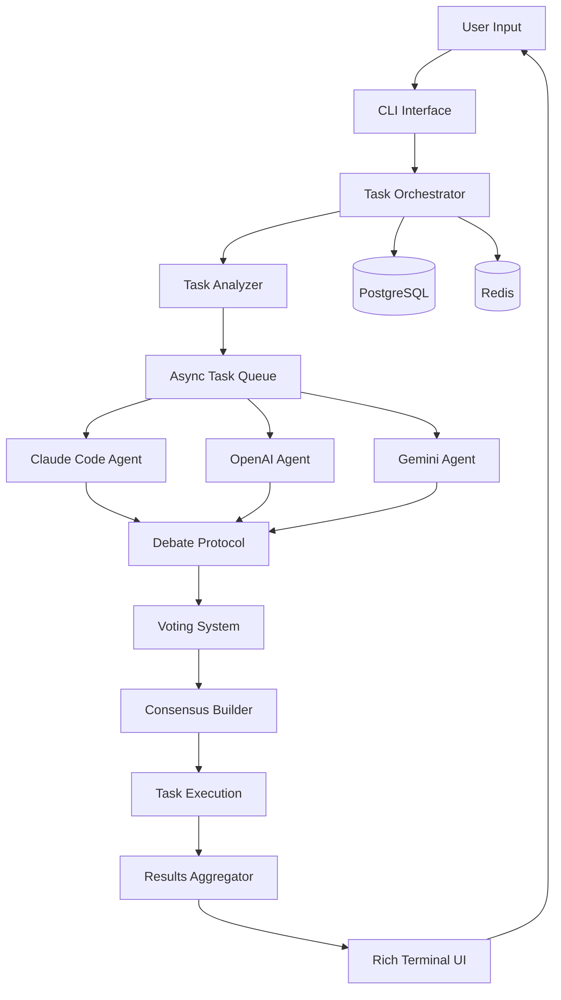

# AngelaMCP Architecture Documentation

## 🏗️ System Overview

The Multi-AI Agent Collaboration Platform (AngelaMCP) is designed as a modular, scalable system that orchestrates collaboration between multiple AI agents with Claude Code as the primary agent.

## 🔄 Core Architecture Flow



## 🧩 Component Architecture

### 1. **Agent Layer**

```python
# Base Agent Interface
class BaseAgent(ABC):
    """Abstract base class for all AI agents."""
    
    @abstractmethod
    async def generate(self, prompt: str, context: Context) -> AgentResponse:
        """Generate response from agent."""
        pass
    
    @abstractmethod
    async def critique(self, solution: Solution) -> Critique:
        """Critique another agent's solution."""
        pass
```

**Agent Hierarchy:**
- **Claude Code Agent** (Senior Developer)
  - Primary task execution
  - File system operations
  - Code execution capabilities
  - Final decision authority

- **OpenAI Agent** (Code Reviewer)
  - Code quality assessment
  - Security analysis
  - Performance optimization suggestions

- **Gemini Agent** (Research Specialist)
  - Documentation generation
  - Best practices research
  - Parallel task execution

### 2. **Orchestration Layer**

The orchestrator manages the entire collaboration workflow:

```python
class TaskOrchestrator:
    """Manages agent collaboration and task execution."""
    
    async def execute_task(self, task: Task) -> TaskResult:
        # 1. Analyze task complexity
        analysis = await self.analyze_task(task)
        
        # 2. Distribute to agents
        if analysis.requires_collaboration:
            return await self.collaborative_execution(task)
        else:
            return await self.single_agent_execution(task)
    
    async def collaborative_execution(self, task: Task) -> TaskResult:
        # 1. Parallel proposal generation
        proposals = await self.gather_proposals(task)
        
        # 2. Debate phase
        debate_result = await self.conduct_debate(proposals)
        
        # 3. Voting and consensus
        consensus = await self.reach_consensus(debate_result)
        
        # 4. Execute final solution
        return await self.execute_solution(consensus)
```

### 3. **Collaboration Protocol**

#### **Debate System**

```
┌─────────────────────────────────────────┐
│           Debate Protocol               │
├─────────────────────────────────────────┤
│ 1. Initial Proposals                    │
│    - Each agent submits solution        │
│    - Time limit: 180 seconds            │
│                                         │
│ 2. Critique Round                       │
│    - Agents review others' proposals    │
│    - Identify strengths/weaknesses      │
│                                         │
│ 3. Rebuttal Phase                       │
│    - Agents defend their approaches     │
│    - Incorporate valid feedback         │
│                                         │
│ 4. Final Proposals                      │
│    - Submit refined solutions           │
│    - Ready for voting                   │
└─────────────────────────────────────────┘
```

#### **Voting Mechanism**

```python
class VotingSystem:
    """Weighted voting system for agent consensus."""
    
    VOTE_WEIGHTS = {
        "claude_code": 2.0,  # Senior developer weight
        "openai": 1.0,
        "gemini": 1.0
    }
    
    def calculate_winner(self, votes: List[Vote]) -> Solution:
        # Weighted scoring with Claude Code having veto power
        scores = self.calculate_weighted_scores(votes)
        
        if self.claude_has_strong_objection(votes):
            return self.get_claude_preferred_solution()
        
        return self.get_highest_scored_solution(scores)
```

### 4. **Task Management**

#### **Task Classification**

```python
@dataclass
class TaskClassification:
    primary_agent: AgentType
    supporting_agents: List[AgentType]
    collaboration_required: bool
    parallel_tasks: List[SubTask]
    estimated_complexity: ComplexityLevel
```

#### **Async Task Queue**

```python
class AsyncTaskQueue:
    """Manages parallel task execution."""
    
    async def process_tasks(self, tasks: List[Task]):
        # Primary task for Claude Code
        primary_task = self.extract_primary_task(tasks)
        
        # Parallel tasks for supporting agents
        parallel_tasks = self.extract_parallel_tasks(tasks)
        
        # Execute concurrently
        results = await asyncio.gather(
            self.claude_code.execute(primary_task),
            *[self.execute_parallel(task) for task in parallel_tasks]
        )
        
        return self.merge_results(results)
```

### 5. **Persistence Layer**

#### **Database Schema**

```sql
-- Conversations table
CREATE TABLE conversations (
    id UUID PRIMARY KEY DEFAULT gen_random_uuid(),
    session_id UUID NOT NULL,
    started_at TIMESTAMP DEFAULT CURRENT_TIMESTAMP,
    ended_at TIMESTAMP,
    status VARCHAR(50) NOT NULL,
    metadata JSONB
);

-- Messages table
CREATE TABLE messages (
    id UUID PRIMARY KEY DEFAULT gen_random_uuid(),
    conversation_id UUID REFERENCES conversations(id),
    agent_type VARCHAR(50) NOT NULL,
    role VARCHAR(20) NOT NULL,
    content TEXT NOT NULL,
    metadata JSONB,
    created_at TIMESTAMP DEFAULT CURRENT_TIMESTAMP
);

-- Task executions table
CREATE TABLE task_executions (
    id UUID PRIMARY KEY DEFAULT gen_random_uuid(),
    conversation_id UUID REFERENCES conversations(id),
    task_type VARCHAR(100),
    status VARCHAR(50),
    input_data JSONB,
    output_data JSONB,
    debate_data JSONB,
    voting_data JSONB,
    started_at TIMESTAMP,
    completed_at TIMESTAMP
);

-- Agent proposals table
CREATE TABLE agent_proposals (
    id UUID PRIMARY KEY DEFAULT gen_random_uuid(),
    task_execution_id UUID REFERENCES task_executions(id),
    agent_type VARCHAR(50),
    proposal_content TEXT,
    critique_data JSONB,
    vote_count INTEGER DEFAULT 0,
    created_at TIMESTAMP DEFAULT CURRENT_TIMESTAMP
);
```

#### **Caching Strategy**

```python
class CacheManager:
    """Redis-based caching for active sessions."""
    
    async def cache_conversation(self, session_id: str, data: dict):
        # Cache active conversation in Redis
        key = f"conversation:{session_id}"
        await self.redis.setex(
            key, 
            settings.SESSION_TIMEOUT, 
            json.dumps(data)
        )
    
    async def get_cached_conversation(self, session_id: str):
        # Retrieve from cache, fallback to DB
        cached = await self.redis.get(f"conversation:{session_id}")
        if cached:
            return json.loads(cached)
        
        # Load from PostgreSQL and re-cache
        return await self.load_from_db(session_id)
```

### 6. **UI Layer**

#### **Terminal Interface Architecture**

```python
class RichTerminalUI:
    """Rich terminal interface with real-time updates."""
    
    def __init__(self):
        self.console = Console()
        self.layout = self.create_layout()
        self.live = Live(self.layout, console=self.console)
    
    def create_layout(self) -> Layout:
        # Split terminal into sections
        return Layout()
            .split_row(
                Layout(name="agents", ratio=3),
                Layout(name="status", ratio=1)
            )
            .split_column(
                Layout(name="output", ratio=4),
                Layout(name="input", ratio=1)
            )
```

## 🔐 Security Architecture

### **API Key Management**
- Environment variables for API keys
- Never logged or exposed in outputs
- Encrypted storage in database

### **Input Validation**
- Pydantic models for all inputs
- SQL injection prevention via SQLAlchemy
- Rate limiting per API

### **Error Handling**
```python
class ErrorHandler:
    """Centralized error handling with fallbacks."""
    
    async def handle_agent_error(self, agent: str, error: Exception):
        # Log error with context
        logger.error(f"Agent {agent} error", exc_info=error)
        
        # Attempt fallback strategies
        if isinstance(error, RateLimitError):
            await self.handle_rate_limit(agent)
        elif isinstance(error, APIError):
            await self.attempt_retry(agent)
        
        # Graceful degradation
        return self.get_fallback_response(agent)
```

## 📊 Performance Considerations

### **Concurrency Model**
- AsyncIO for I/O-bound operations
- Thread pool for CPU-bound tasks
- Connection pooling for databases

### **Optimization Strategies**
1. **Batch API Calls**: Group related requests
2. **Smart Caching**: Cache common queries
3. **Lazy Loading**: Load agent responses on-demand
4. **Stream Processing**: Process responses as they arrive

## 🔄 Data Flow Example

```
1. User Input: "Create a REST API with authentication"
   ↓
2. Task Analysis:
   - Type: Development
   - Complexity: High
   - Requires: Collaboration
   ↓
3. Task Distribution:
   - Claude Code: Main API implementation
   - Gemini: Research auth best practices
   - OpenAI: Prepare security review
   ↓
4. Parallel Execution:
   - All agents work simultaneously
   - Results streamed to UI
   ↓
5. Debate Phase:
   - JWT vs Session debate
   - Security considerations
   - Performance analysis
   ↓
6. Voting:
   - Claude Code: JWT (weight: 2.0)
   - OpenAI: Sessions (weight: 1.0)
   - Gemini: JWT (weight: 1.0)
   - Result: JWT wins
   ↓
7. Implementation:
   - Claude Code implements JWT auth
   - Creates files, writes code
   - Other agents review
   ↓
8. Output:
   - Complete API with JWT auth
   - Documentation by Gemini
   - Security notes by OpenAI
```

## 🚀 Scalability Paths

1. **Horizontal Scaling**
   - Multiple orchestrator instances
   - Load balancing via Redis queues
   - Distributed task processing

2. **Agent Scaling**
   - Dynamic agent pools
   - Plugin architecture for new agents
   - Custom agent implementations

3. **Storage Scaling**
   - PostgreSQL read replicas
   - Redis clustering
   - S3 for file storage

---
